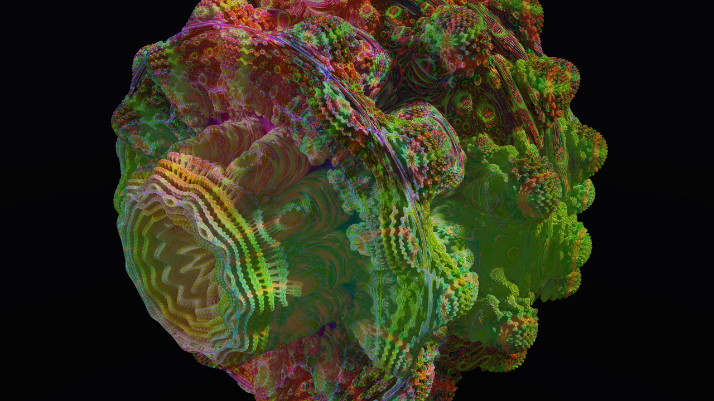

# schism

Spectral fractal path tracer. Renders 3D fractal geometry using signed distance fields and physically-based path tracing with Vulkan compute shaders.


`schism --fractal mandelbulb --power 12 --seed a4f29c`

## How it works

SDF raymarching through mathematically infinite fractal detail, combined with physically-based path tracing for realistic light transport. The rendering pipeline runs entirely on the GPU via a single Vulkan compute dispatch - no graphics pipeline, no render passes. A multi-threaded CPU fallback is used when no GPU is available.

The path tracer implements GGX microfacet BRDF with Fresnel-Schlick reflectance, soft shadow rays, SDF-based ambient occlusion, orbit trap coloring, up to 6 light bounces with russian roulette termination, and ACES filmic tonemapping.

## Usage

```
# render a mandelbulb at 1280x720
schism --fractal mandelbulb --width 1280 --height 720 -o render.png

# specific seed for reproducibility (random if omitted)
schism --fractal menger --seed 7b3e1d -o render.png
# seed: 7b3e1d

# vary the fractal power for different shapes
schism --fractal mandelbulb --power 4 -o smooth.png
schism --fractal mandelbulb --power 12 -o detailed.png

# force CPU rendering
schism --fractal julia --cpu -o render.png
```

## Seed system

Every render is deterministic. Pass `--seed <hex>` to reproduce an exact image. Without a seed, a random one is generated and printed to stdout.

Same seed + same parameters = identical output, every time.

## Supported fractals

- **Mandelbulb** - the 3D analog of the Mandelbrot set
- **Menger sponge** - recursive cubic fractal with infinite surface area and zero volume
- **Sierpinski** - tetrahedral recursive subdivision
- **Julia sets** - 3D quaternion Julia sets
- **Kleinian groups** - limit sets of Mobius transformations
- **IFS** - iterated function system fractals

## Building

Requires Zig 0.15+ and Vulkan SDK (vulkan-headers, vulkan-loader, glslang). On macOS, also install molten-vk.

```
brew install vulkan-headers vulkan-loader molten-vk glslang  # macOS
zig build
zig build test
```

Build without Vulkan (CPU-only):

```
zig build -Dskip-vulkan
```

## About

This project is an experiment in AI-maintained open source - autonomously built, tested, and refined by AI with human oversight. Regular audits, thorough test coverage, continuous refinement. The emphasis is on high quality, rigorously tested, production-grade code.
